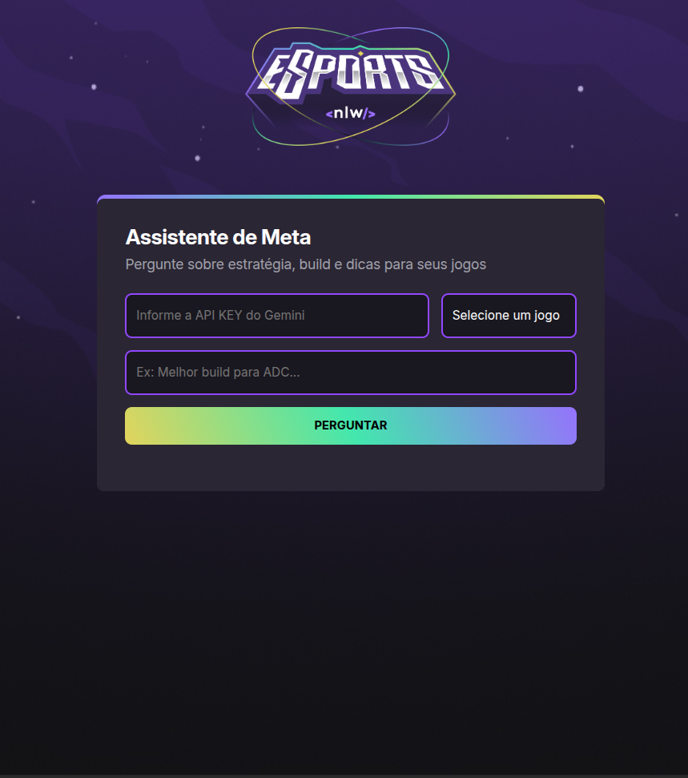

# 🎮 Assistente de Meta | Projeto NLW da Rocketseat

> Um app inteligente que responde perguntas sobre estratégias, builds e dicas para jogos competitivos — powered by Gemini AI.


---

## 🚀 Sobre o Projeto

O **Assistente de Meta** é uma aplicação web desenvolvida durante a **Next Level Week (NLW)** da [Rocketseat](https://rocketseat.com.br/), com foco em IA generativa e interfaces modernas.

Com ele, jogadores podem obter respostas rápidas e atualizadas sobre o meta de jogos como:

🎯 Valorant  
🧙 League of Legends  
⚔️ Dota 2  
🔫 CS:GO  

---

## 🧠 O que ele faz?

- Recebe perguntas sobre estratégias, builds ou dicas.
- Usa a API do Gemini (Google AI) para gerar respostas com base no patch atual.
- Converte a resposta em Markdown para HTML.
- Exibe tudo com uma interface responsiva e estilizada.

---

## 💻 Tecnologias Utilizadas

| Categoria     | Ferramenta / Linguagem         |
|---------------|---------------------------------|
| Estrutura     | HTML5                          |
| Estilo        | CSS3 (Flexbox, Gradientes, Animações) |
| Lógica        | JavaScript Vanilla             |
| Markdown      | showdown.js                    |
| IA            | Gemini API (Google Generative AI) |

---

## 📸 Interface

<div align="center">
  
</div>

---

## 🧪 Como usar

👉 Vá para: [Link](https://jeffersonrsantana.github.io/Assistente-de-Meta-NLW/)

ou

1. Clone o repositório:
   ```bash
   git clone https://github.com/seu-usuario/assistente-meta-nlw.git
  

  
 ## 🔑 Como obter sua API Key do Gemini

Para que o Assistente de Meta funcione corretamente, você precisa de uma chave de API da plataforma Gemini (Google AI). Siga os passos abaixo:

---

### 2. Acesse o Google AI Studio

👉 Vá para: [https://aistudio.google.com/app/apikey](https://aistudio.google.com/app/apikey)

> Obs: Você precisa estar logado com uma conta Google.

---

### 3. Gere sua chave de API

- Clique no botão **"Create API Key"** (ou "Criar chave de API").
- Dê um nome para sua chave (ex: "Assistente de Meta").
- Copie a chave gerada com cuidado — ela será usada no app.

---

### 4. Cole a chave no campo do app

- Abra o Assistente de Meta no navegador.
- Cole sua chave no campo:  
  `🔐 Informe a API KEY do Gemini`
- Agora é só escolher o jogo, digitar sua pergunta e clicar em **Perguntar**!

---

### ⚠️ Importante

- Nunca compartilhe sua chave publicamente.
- Essa chave dá acesso à sua cota de uso da API Gemini.
- Se quiser revogar ou criar uma nova, volte ao [AI Studio](https://aistudio.google.com/app/apikey).

---

Pronto! Agora você pode conversar com a IA sobre o meta dos seus jogos favoritos. 🎮✨

Feito com 💜 por Jefferson 📫 [Linkedin](https://www.linkedin.com/in/jeffersonnsaantana/)
